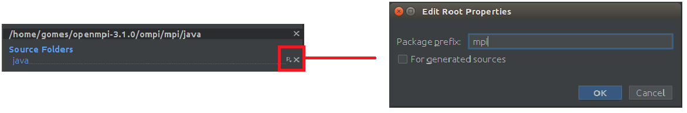

# otm-mpi
Open Traffic Models - MPI communication: This a parallized version of the [OTM](https://github.com/ggomes/otm-sim) simulation engine that uses Message Passing Interface for communicating for multi-core communication. It can run on high performance computing (HPC) resources and exploiting parallel computation and HPC power to significantly speed up large-scale traffic simulations.

## Installation

1. export OTMSIMJAR=< path to otm-sim [jar file](https://mymavenrepo.com/repo/XtcMAROnIu3PyiMCmbdY/otm/otm-sim/1.0-SNAPSHOT/) >
2. export OTMMPIHOME=< path to otm-mpi >
3. chmod u+x scripts/*.sh
4. [Download metis-5.1.0.tar.gz](http://glaros.dtc.umn.edu/gkhome/metis/metis). Follow the build instructions.
5. Install [open-mpi 3.1](https://www.open-mpi.org/software/ompi/v3.1/)

In IntelliJ:

4. Add otm-sim jar: Project Structure -> Modules -> Dependencies -> + JARs or directories...
5. Add mpi jar: Project Structure -> Modules -> Sources
   * Add Content Root: openmpi-3.1.0/ompi/mpi/java
   * Change the mpi package prefix
   

